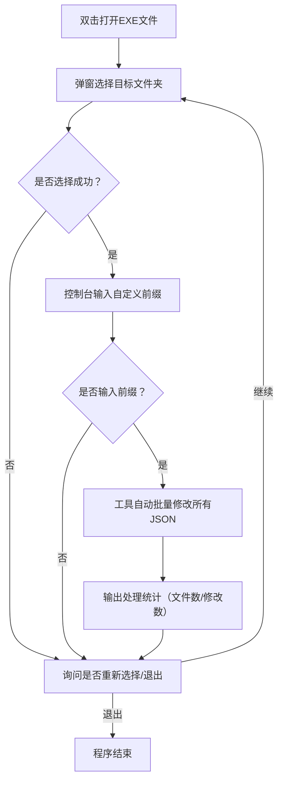

# Python批量修改JSON文件label字段工具：支持子文件夹+多轮执行+EXE打包

### 一、需求背景

日常工作中经常遇到这样的场景：需要给大量 JSON 文件的`label`字段统一添加自定义前缀，但手动修改效率极低，尤其遇到以下情况更麻烦：


* 文件夹包含多层子文件夹，JSON 文件分散；

* 需要重复处理多个文件夹，反复启动程序浪费时间；

* 同事没有 Python 环境，无法直接运行脚本。

因此开发了这款工具，完美解决以上问题，支持可视化操作、多轮执行、无环境依赖，大幅提升工作效率。

### 二、工具核心功能

这款 JSON label 批量修改工具，堪称 “效率神器”，核心特性如下：


1. **可视化选文件夹**：无需手动输入路径，弹窗选择目标文件夹，支持中文路径；

2. **递归遍历子文件夹**：自动扫描目标文件夹下所有层级的 JSON 文件，不会遗漏嵌套文件；

3. **自定义前缀**：灵活输入需要添加的前缀，适配不同业务场景；

4. **多轮重复执行**：处理完一个文件夹后，可直接选择继续处理其他文件夹，无需重启程序；

5. **中文无乱码**：全程 UTF-8 编码适配，中文路径、中文 label 值都能正常处理；

6. **EXE 无依赖运行**：打包成单个 EXE 文件，无需安装 Python，双击即可使用；

7. **详细日志输出**：实时显示每个文件处理状态，最终输出统计结果，进度清晰可见；

8. **保留原格式**：修改后 JSON 文件保持原有缩进，不影响后续使用。

### 三、操作流程（超简单）




### 四、核心代码片段（关键逻辑解析）

#### 1. 递归遍历文件夹（含子文件夹）


```
import os

def modify\_json\_label(folder\_path, prefix):

&#x20;   modified\_files = 0

&#x20;   modified\_labels = 0

&#x20;   \# os.walk自动遍历所有子层级

&#x20;   for root\_dir, sub\_dirs, files in os.walk(folder\_path):

&#x20;       for filename in files:

&#x20;           if filename.lower().endswith(".json"):

&#x20;               file\_path = os.path.join(root\_dir, filename)

&#x20;               try:

&#x20;                   \# 读取JSON文件（强制UTF-8编码）

&#x20;                   with open(file\_path, 'r', encoding='utf-8') as f:

&#x20;                       data = json.load(f)

&#x20;                  &#x20;

&#x20;                   \# 递归修改所有层级的label字段（核心逻辑）

&#x20;                   def update\_label(obj):

&#x20;                       nonlocal modified\_labels

&#x20;                       if isinstance(obj, dict):

&#x20;                           for key, value in obj.items():

&#x20;                               if key == "label" and isinstance(value, str):

&#x20;                                   obj\[key] = f"{prefix}{value}"  # 前缀拼接原始值

&#x20;                                   modified\_labels += 1

&#x20;                               else:

&#x20;                                   update\_label(value)

&#x20;                       elif isinstance(obj, list):

&#x20;                           for item in obj:

&#x20;                               update\_label(item)

&#x20;                  &#x20;

&#x20;                   update\_label(data)

&#x20;                  &#x20;

&#x20;                   \# 写回文件（保留缩进）

&#x20;                   with open(file\_path, 'w', encoding='utf-8') as f:

&#x20;                       json.dump(data, f, ensure\_ascii=False, indent=4)

&#x20;                  &#x20;

&#x20;                   modified\_files += 1

&#x20;                   print(f"✅ 完成处理：{file\_path}")

&#x20;               except Exception as e:

&#x20;                   print(f"❌ 处理失败：{file\_path} → {str(e)}")

&#x20;   \# 输出统计结果

&#x20;   print(f"\n📊 处理完成：{modified\_files}个文件，修改{modified\_labels}个label")
```

#### 2. 多轮执行询问逻辑


```
def ask\_continue():

&#x20;   while True:

&#x20;       choice = input("请选择：\n  输入 'y' 或 '继续' → 处理其他文件夹\n  输入 'n' 或 '退出' → 关闭程序\n你的输入：").strip().lower()

&#x20;       if choice in \['y', '继续']:

&#x20;           return True

&#x20;       elif choice in \['n', '退出']:

&#x20;           return False

&#x20;       else:

&#x20;           print(f"❌ 输入无效，请重新输入！")
```

以上仅展示核心逻辑片段，完整代码（含中文编码适配、文件夹选择弹窗、EXE 打包适配）需通过下方渠道获取。

### 五、EXE 打包步骤（获取完整代码后操作）


1. 安装 Python 3.6 + 和打包工具：


```
pip install pyinstaller
```


1. 保存完整代码为`modify_json_label.py`，放在单独文件夹；

2. 打开 CMD 切换到该文件夹，执行打包命令：


```
pyinstaller -F -i NONE --console --hidden-import tkinter modify\_json\_label.py
```


1. 打包完成后，在`dist/`目录下找到`modify_json_label.exe`，双击即可运行。

### 六、常见问题解决


1. **打包后提示 “找不到 tkinter”**：重新执行打包命令，确保添加`--hidden-import tkinter`；

2. **中文乱码**：打开 CMD 执行`chcp 65001`切换 UTF-8 编码，再运行 EXE；

3. **EXE 启动慢**：改用文件夹打包（替换`-F`为`-D`），启动速度更快；

4. **处理文件报错**：检查 JSON 文件是否有语法错误，或是否被其他程序占用。

### 七、获取完整代码 + EXE 工具

为了方便大家使用，我已将**完整 Python 代码**和**打包好的 EXE 文件**整理完毕，关注下方微信公众号，回复关键词「JSON 工具」即可免费获取：

### 八、作者矩阵（欢迎交流）


* 抖音：从 0 至 1（分享 Python 自动化实操、效率工具教程）

* 微信公众号：从 0 至 1（获取完整代码 + EXE）

* 博客网站：[www.from0to1.cn](https://www.from0to1.cn)（更多 Python 实战教程、技术干货）

* GitHub：[https://github.com/mtnljbydd](https://github.com/mtnljbydd)（开源更多实用工具脚本）

如果工具帮到你，欢迎转发分享给需要的朋友～ 如有新的功能需求或问题，可通过上述矩阵联系我，会持续优化更新！

> （注：文档部分内容可能由 AI 生成）